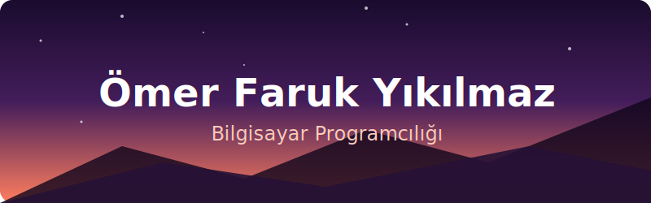

  

# 👋 Selam, Ben Ömer!

### 💻 Yazılım | 🛡️ Siber Güvenlik | 🐧 Linux Tutkunu

 

_"Kodların derinliklerinde gezinmeyi ve sistemlerin nasıl çalıştığını anlamayı seviyorum."_
 
_"Sürekli öğrenmeye, deneyerek gelişmeye çalışan biriyim. Yeni teknolojileri keşfetmek en büyük tutkum."_
  

---

### 🚀 Hakkımda

Bilgisayarla 12 yaşında tanıştığımda, ekrandaki görüntünün ötesini, sistemin **nasıl çalıştığını** merak etmeye başladım. Bu merak beni kod yazmaya ve algoritmik düşünmeye yöneltti.

14–15 yaşlarımda **Arduino** ile tanışınca yazılımın fiziksel dünyadaki etkisini gördüm ve robotik projeler geliştirdim. **TÜBİTAK** ve **TEKNOFEST** gibi platformlarda projelerle yer aldım; her ne kadar istediğim dereceleri alamamış olsam da, bu süreç bana **tecrübe kazanmayı ve pes etmemeyi** öğretti.

Bugün hâlâ aynı heyecanla; **algoritmalar ve programlama mantığı**, **Linux** ve **Siber Güvenlik** alanlarında kendimi geliştirmeye, öğrenmeye ve üretmeye devam ediyorum.

 

---

### 🛠️ Yetenekler ve Teknolojiler

| **Kategori** | **Teknolojiler** |
| :--- | :--- |
| **Programlama Dilleri** |  |
| **Araçlar & Sistemler** |  |
| **Donanım** |  |

 

---

### 🎓 Eğitim Bilgileri

| Okul | Bölüm / Detay | Tarih |
| :--- | :--- | :--- |
| **Kocaeli Üniversitesi MYO** | **Bilgisayar Programcılığı** (1. Sınıf) | 2025 - Günümüz |
| **Gazeteci Çetin Altan MTAL** | Bilişim Teknolojileri   ✨ **Derece ile Mezuniyet** | 2021 - 2025 |

 

---

### 🎯 İlgi Alanları

- ✍️ Boş zamanlarımda kendimce şiir yazıyorum; bu uğraş kafamı resetlemeye ve yaratıcı bakış açıları geliştirmemi sağlıyor.
- 📚 Kitap okumayı seviyorum. Özellikle bakış açısı kazandıran ve sonu hakkında kafa yorulan esserleri çok severim.
- 🎬 Film izlemek benim için sadece eğlence değil; anlatım dili, atmosfer ve hikâye yapısını analiz etmeyi seviyorum.  
  İzlediklerimi ve kısa değerlendirmelerimi [Letterboxd profilimde](https://letterboxd.com/Omer_Fqaruk/) paylaşıyorum.

 

---

### 📬 İletişim

Projeler, fikir alışverişi veya sadece tanışmak için:

 

---
 

    
  <b>Ziyaretiniz için çok teşekkür ederim.</b>

